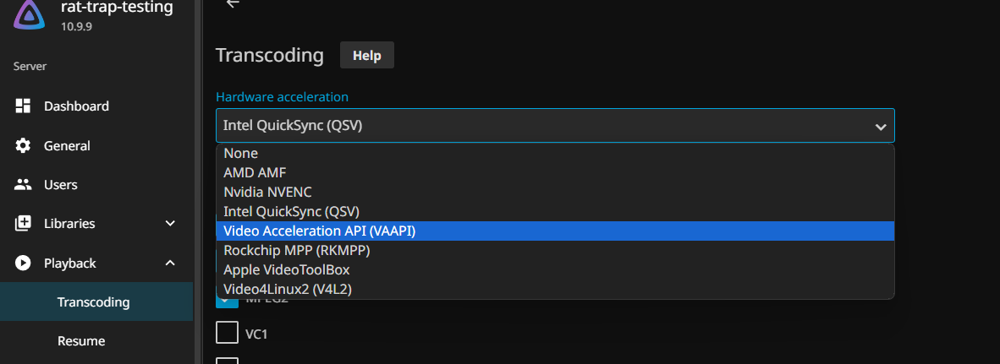
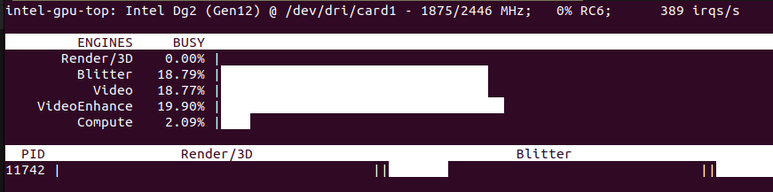

# Jellyfin
___
## Hardware Transcoding Settings
May need to set **Dashboard > Transcoding > Hardware Acceleration** and set your GPU device.




You can find the correct name in /dev/dri of your VM or run `sudo intel_gpu_top` (`sudo apt install intel-gpu-tools` if not installed) 


___

## ffmpeg

May need to if jellyfin-ffmpeg6 can't be installed 

```
sudo add-apt-repository universe

sudo apt update

sudo apt install jellyfin-ffmpeg6
```
___
