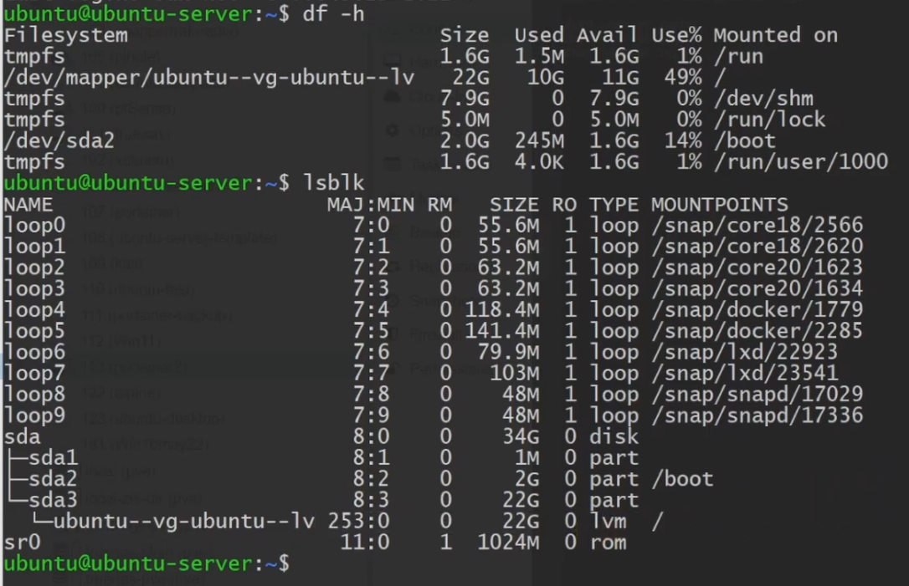
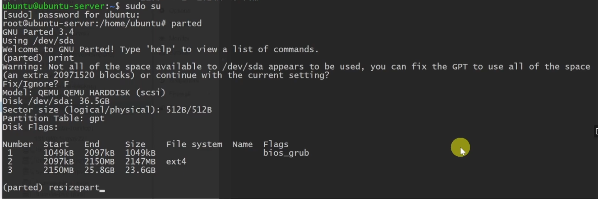
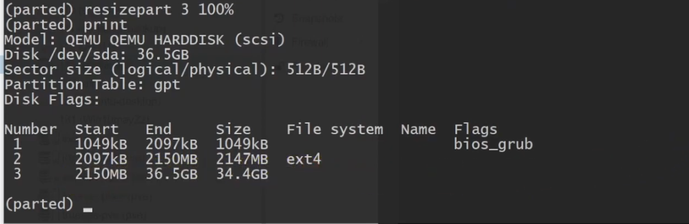
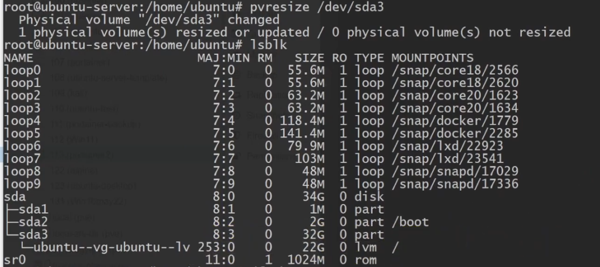
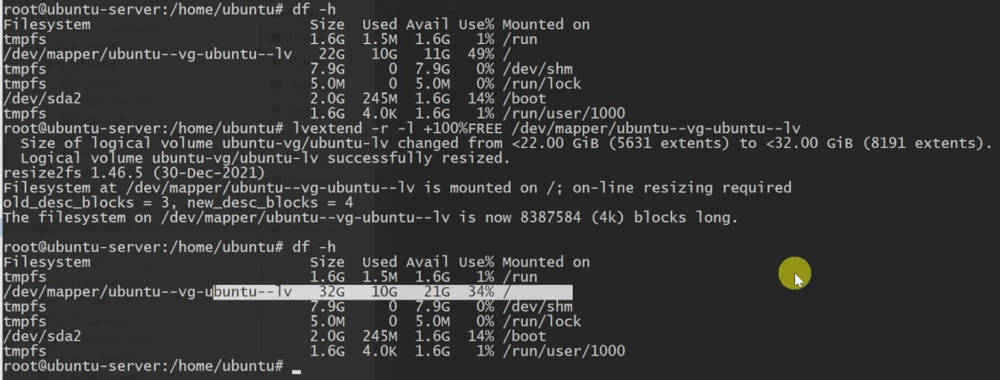

# How to resize Proxmox VM partitions

*Thursday, July 4th, 2024* by **devP**

## Resize Disk by adding space to disk

First, resize your VM disk via the GUI 

> VM > Hardware > Hard Disk (scsi0) > Disk Action > Resize > Enter desired size Apply
> 


or via commandline of your proxmox host

You can resize your disks online or offline with command line:

`qm resize <vmid> <disk> <size> `

example: to add 5G to your virtio0 disk on vmid100:

`qm resize 100 virtio0 +5G`


## Extend disk space 

- SSH into selected VM 

- Install parted if not installed
```
sudo apt install parted -y
```

- Run the following to find the drive and partitions names:
```
df -h

lsblk
```


- Become sudo
```
sudo su
```

Run the following:
```
parted

print
```
- If prompted, `f` for Fix (view screenshot below)




- Resize partition
```
resizepart 3 100%
```


- Exit out of parted
linux `CTRL+C` or mac `CMD+C`

- Resize physical volume
```
pvresize /dev/sda3
```


- Extend logical volume to 100% of free space in volume
```
lvextend -r -l +100%FREE /dev/mapper/ubuntu--vg-ubuntu--lv
```


- Restart VM if changes aren't reflected